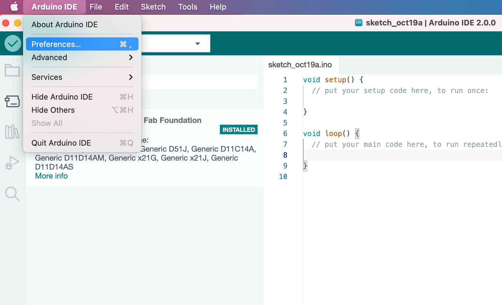
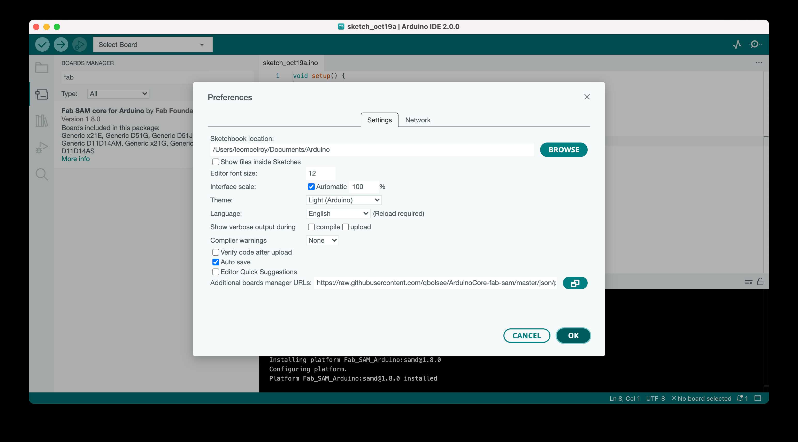
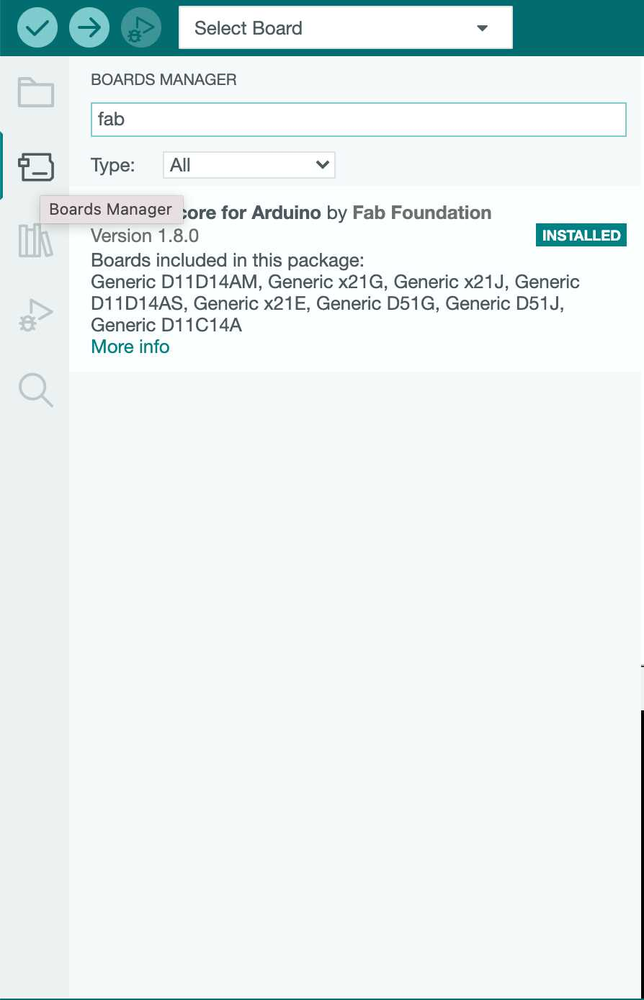
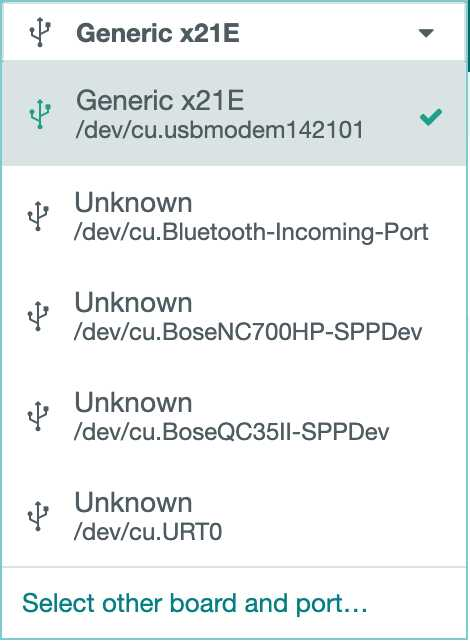
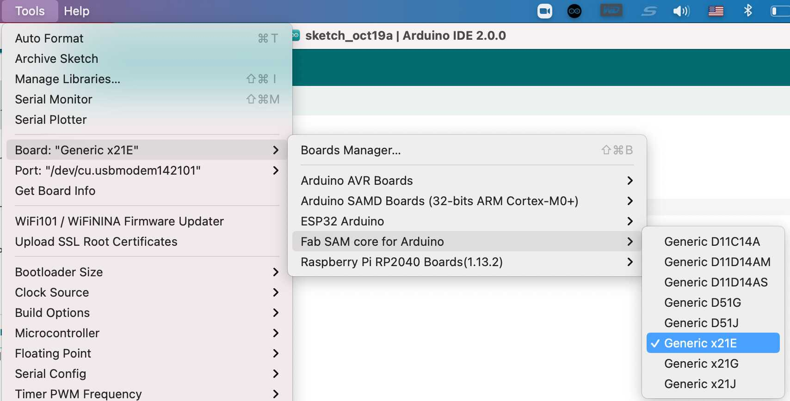

# Programming a SAMD Chip

We're going to be using the Arduino IDE to program SAMD chips.

### Load a bootloader onto the chip

We'll have to use a programmer to load a program which will allow our chip to be programmed through the serial port.


You'll have to hook up a programmer as demonstrated in [PROGRAM_PROGRAMMER.md](./PROGRAM_PROGRAMMER.md).


Then download the appropriate bootloader [here](./bootloaders) and flash it to your board by navigating to its directory and running `openocd`.

### Set up Arduino IDE

Download the [Arduino IDE from here](https://www.arduino.cc/en/software). 

You'll have to add the ArduinoCore for the SAMD family of chips. 

Navigate to `Arduino IDE` > `Preferences`.



Then in `Additional boards manager URLs` paste this link:

```
https://raw.githubusercontent.com/qbolsee/ArduinoCore-fab-sam/master/json/package_Fab_SAM_index.json
```



Navigate to the boards manager. 

Search for `fab`. 

Install `Fab SAM core for Arduino` by `Fab Foundation`.



### Programming Your Board

You'll have to know how your board is designed to identify which pins should do what. Here is an example program to flash a light with a button. In this case we're using a SAMD21e17.

```
#define PIN_LED_R 15
#define PIN_LED_G 16
#define PIN_LED_B 17

#define PIN_BUTTON 7

void setup() {
  // put your setup code here, to run once:
  digitalWrite(PIN_LED_R, HIGH);
  digitalWrite(PIN_LED_G, HIGH);
  digitalWrite(PIN_LED_B, HIGH);
  pinMode(PIN_LED_R, OUTPUT);
  pinMode(PIN_LED_G, OUTPUT);
  pinMode(PIN_LED_B, OUTPUT);
  pinMode(PIN_BUTTON, INPUT_PULLUP);
}

void loop() {
  // put your main code here, to run repeatedly:
  int value = digitalRead(PIN_BUTTON);
  if (value) {
    analogWrite(PIN_LED_B, 255);
  } else {
    analogWrite(PIN_LED_B, 220);
  }

  delay(1);
}
```

To load this onto the board plug the board in. Select the appropriate port and board.





Next hit `Upload` to load your code onto the board.


